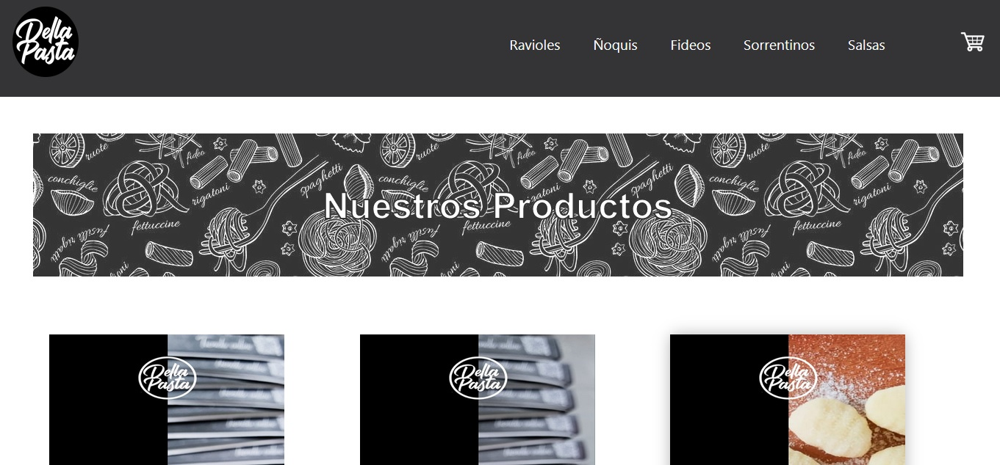

#DellaPasta

##Proyecto final de E-commerce en React 

###El cual es una tienda sobre una fábrica de pastas artesanales

>Link del Sitio Web
[Della Pasta Tienda](https://dellapasta.netlify.app/#/ )

>Presentación


[Della Pasta](https://dellapasta.netlify.app/#/ )


>Descripción del sitio web
* El sitio web **DellaPasta** cuenta con una pagina de inicio  con todos los productos
* Nav cuenta con el Logo, 5 categorias distintas de productos (Ravioles, Ñoquis, Fideos, Sorrentinos, Salsas) y el Carrito de compras
* Por cada producto se encuentran las siguientes opciones:
            1. ```Ver Detalles```
            2. ```Agregar la cantidad deseada``` 
            3. ```Agregar al Carrito```
            4. ```Ver Carrito```
* Una vez en el Carrito se encuentran las siguientes opciones:
            1.  hacer click en el botón de ```X``` para eliminar el producto en caso de cargarlo erroneamente
            2. Botón de: ```Vaciar Carrito```
            3. Botón de: ```Finalizar Compra ```
* Si se click sobre el boton de ```Vaciar Carrito```, se eliminarán todos los archivos de la lista
* Si se hace click sobre el botón de ```Finalizar Compra``` aparecerá un formulario para completar para realizar la compra correctaete
* Si los datos son cargados correctamente aparecerá un cartel haciendo mención de que la operación fue exitosa
* Esos datos quedan guardados en el ```Firebase```


>Metodologías Aplicadas
* Componentes React
* Props
* UseState
* UseEffect
* Manual Promise
* JS
* CSS
* Material
* Context
* Firebase

